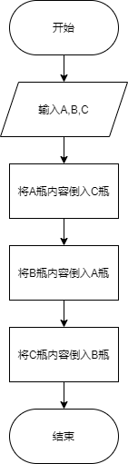
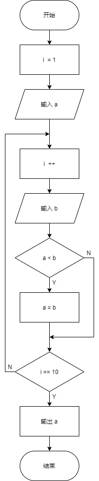
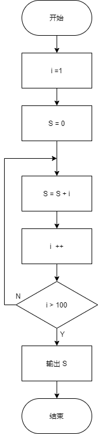
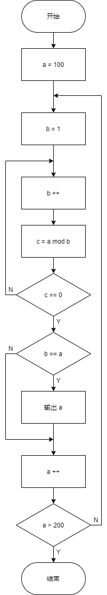
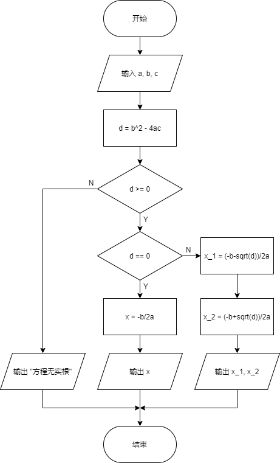

# 0929-homework-source

## 进制转换

(1) (保留小数时有舍入)
```
123(DEC) = 1111011(BIN) = 173(OCT) = 7b(HEX)
8962.5827(DEC) = 10001100000010.1001(BIN) = 21402.4523(OCT) = 2302.952c(HEX)
```
(2)
```
111011(BIN) = 59(DEC) = 73(OCT) = 3b(HEX)
11001011(BIN) = 203(DEC) = 313(OCT) = cb(HEX)
1101101.010(BIN) = 109.25(DEC) = 155.2(OCT) = 6d.4(HEX)
```
(3)
```
176(OCT) = 1111110(BIN) = 7e(HEX)
51.32(OCT) = 101001.01101(BIN) = 29.68(HEX)
3165.75(OCT) = 11001110101.111101(BIN) = 675.f4(HEX)
```
(4)
```
85e(HEX) = 100001011110(BIN) = 2142(DEC)
a7.2(HEX) = 10100111.001(BIN) = 167.125(DEC)
387.15(HEX) = 1110000111.00010101(BIN) = 903.08203125(DEC)
```

## 算法流程图

**(1)**



**(2)**



**(4)**



**(6)**



**(8)**



---

## At Last

流程图利用 [DrawIO](https://app.diagrams.net/) 制作。
