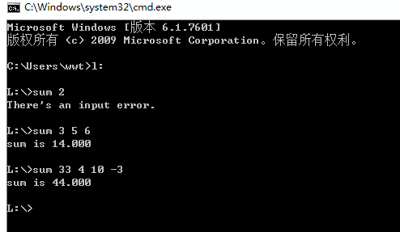

# 1210 作业

## 要点 | Essentials

注意到含参主函数的参数 `char *argv[]` 中，`argv[0]` 是调用程序本体的命令，因而实际的额外参数从 `argv[0]` 开始。

老师的代码仍然写得不太规范。算了，代码这玩意，能跑就行。

---

> 以下内容来自教师在教学群内发送的 .docx 文档，正文部分经过格式调整。

## 1210作业

1. 写一个包含命令行参数的程序，功能要求实现不限数量的参数相加，比如程序文件为 `sum.c`，编译后生成 `sum.exe` 可执行文件，在windows 命令行状态下运行 `.\sum 3 5 6`<kbd>Enter</kbd>，可以实现将 `3`、`5`、`6` 相加，如果运行 `.\sum 3 5 6 10`<kbd>Enter</kbd>，则可以实现将 `3`、`5`、`6`、`10` 相加。

	

	说明：

	- 输入的参数小于两个给出错误信息。

	- win10 环境下按<kbd>Win</kbd>+<kbd>R</kbd>键后在输入框输入 `cmd` 即可打开命令行模式，找到你编译链接生成后的 `sum.exe` 如上图方式运行，也可以直接在编译环境里运行时加参数，如果用的是 vc++6.0 方法是“在菜单栏的工程(project)--设置(settings) 打开，在 debug 选项卡的程序参数(programs arguments) 加入你需要添加的参数。”，如果是 devc++ 方法是“在菜单栏的运行-参数-传递给主函数的参数里面加入需要添加的参数”，其他编译环境如何加参数请自行搜索。

[**sumArg.c**](./sumArg.c)

2. 教材 `330` 页第 `1`、`5` 题，第 `5` 题用结构体数组来实现。

[**structDate.c**](./structDate.c)

[**structScore.c**](./structScore.c)

## 动态申请建立二维数组代码

另外附上用 `malloc()` 申请二维数组空间的代码供大家参考，建议大家自行编写实现调试成功，加强对 `malloc()` 函数的理解。

代码一：先申请指针数组，再用指针数组申请每行空间。

```c
#include<stdio.h>
#include<stdlib.h>
#include<time.h>
void Make_Array(int **q,int m,int n);
void Print_Array(int **q,int m,int n);
main()
{
    int i,row,col,**pb;
    puts("请输入二维数组的行数：");scanf("%d",&row);
    puts("请输入二维数组的列数：");scanf("%d",&col);
    pb=(int **)malloc(row*sizeof(int *));
    if(pb==NULL){puts("error!\n");exit(1);}
    for(i=0;i<row;i++)
    {
        pb[i]=(int *)malloc(col*sizeof(int));
        if(pb[i]==NULL){puts("error!\n");exit(1);}
    }
    Make_Array(pb,row,col);
    Print_Array(pb,row,col);
    for(i=0;i<row;i++)free(pb[i]);
	free(pb);
    return(0);
}
void Make_Array(int **q,int m,int n)
{
    int i,j;
    srand(time(NULL));
    for(i=0;i<m;i++)
        for(j=0;j<n;j++)
            q[i][j]=rand()%100;
}
void Print_Array(int **q,int m,int n)
{
    int i,j;
     for(i=0;i<m;i++)
    {
        for(j=0;j<n;j++)
           printf("%5d",*(*(q+i)+j));
        putchar('\n');
    }
}
```

代码二：直接申请整块空间然后将地址赋给行指针。

```c
#include<stdio.h>
#include<stdlib.h>
#include<time.h>
void Make_Array(int m,int n,int (*pb)[]);
void Print_Array(int m,int n,int (*pb)[]);
main()
{
    int row,col;
    puts("请输入二维数组的行数：");scanf("%d",&row);
    puts("请输入二维数组的列数：");scanf("%d",&col);
    int (*pb)[col];
    pb=(int *)malloc(row*col*sizeof(int));
    if(pb==NULL){puts("error!\n");exit(1);}
    Make_Array(row,col,pb);
    Print_Array(row,col,pb);
    free(pb);
}
void Make_Array(int m,int n,int (*q)[n])
{
    int i,j;
    srand(time(NULL));
    for(i=0;i<m;i++)
        for(j=0;j<n;j++)
            q[i][j]=rand()%100;
}
void Print_Array(int m,int n,int (*q)[n])
{
    int i,j;
     for(i=0;i<m;i++)
    {
        for(j=0;j<n;j++)
           printf("%5d",q[i][j]);
        putchar('\n');
    }
}
```
