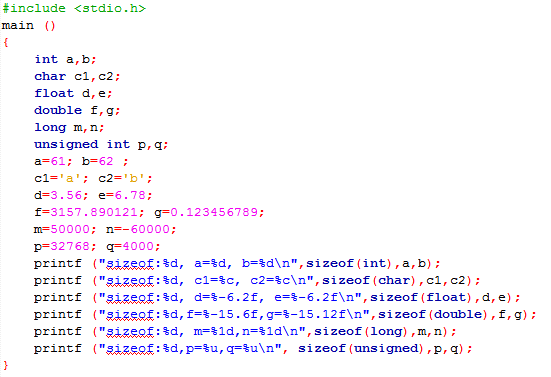
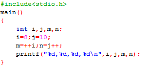

# 第二次上机

1. 输入下列程序并给出运行结果：

	

2. 输入一下程序并给出运行结果：

	

3. 编写程序求下面算术表达式的值。

    - `3.5+1/2+56%10`				设`a=2`
    - `x+a%3*(int)(x+y)%2/4`		设`x=2.5,a=7,y=4.7`
    - `(x>=y>=2)?1:0`				设`x=4,y=3`
    - `!(a>b)&&!c||1`				设`a=3,b=4,c=5`
    - `!(a+b)+c-1&&b+c/2`			设`a=3,b=4,c=5`
	- `a+=a%=a*=a`					设`a=12`

4. 编程实现：输入一个小写字母，将其转换为大写字母输出。

5. 编程实现华氏温度到摄氏温度的转换，转换公式为c=，式中f表示华氏温度，c表示摄氏温度。从键盘输入华氏温度，输出摄氏温度。
