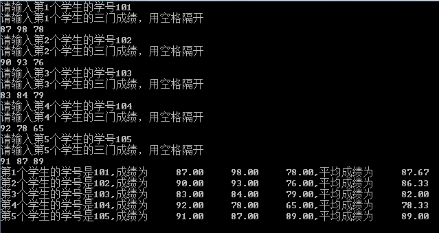
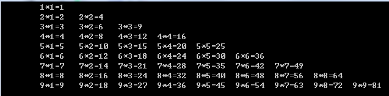

# 第四次上机内容

1. 从键盘输入一个整数 `n`，输出长度为 `n` 的斐波那契数列，要求输出格式每行 `4` 个数，数与数之间用空格间隔开（间隔距离自行设定）。

2. 从键盘输入 `5` 个学生的学号（三位数字，比如 `101` - `103`）和三门课的成绩，计算每个学生的平均成绩并输出其学号和平均成绩，输入输出格式如下图（成绩取小数点后两位）。

	

3. 输出如下图形，`(` 代表空格。

	```
	(((((((*
	((((((* * *
	(((((* * * * *
	((((* * * * * * *
	(((* * * * * * * * *
	((* * * * * * * * * * *
	```

4. 输出九九乘法表，要求格式如下：

	
